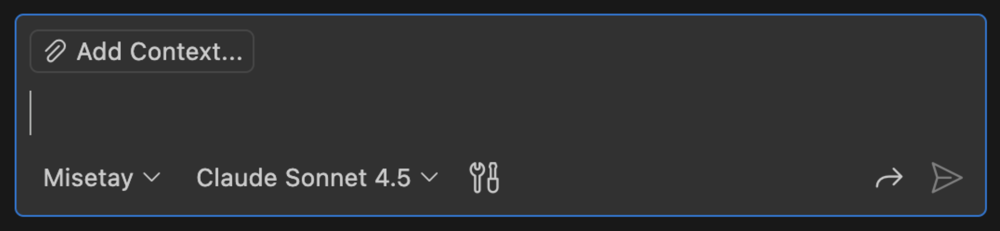
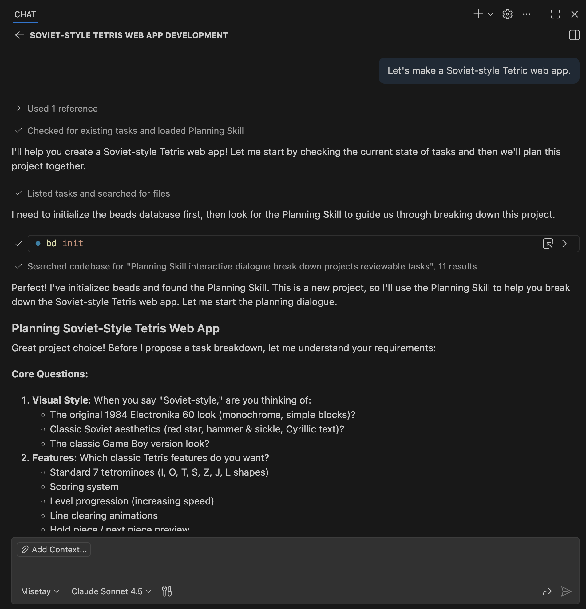
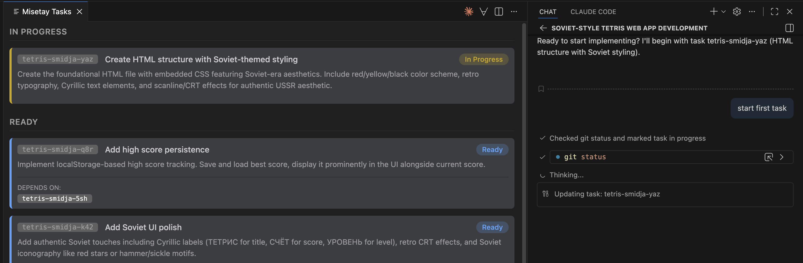

# Misatay - AI Agent Tool that Keeps You in the Loop

Misatay is a VS Code extension for working with AI agents. 
When you build software with Misatay, you are __involved__ and __in charge__.

When Misatay says "All done!", you actually believe it! You're ready to:
- __Slam that merge button__, or
- Pester your colleagues for PR approvals without shame, or
- Deploy, then close your laptop and have a drink

Because: You've already reviewed the code! You were there from the beginning!

Jump to [The Misatay Way](#the-misatay-way) to see the features.

(NOTE: It only works with GitHub Copilot.)

## Installation

It's a VS Code extension. So install it from the marketplace.

In repos where you haven't used Misatay, you have to initialize it. Open the command palette (Cmd-Shift-P) and choose "Misatay: Install Agent". This will add an agent prompt and some skills
to your repo. (I hope to avoid this step in the future, by keep these files in the extension and
out of your repo.)

You are now ready to follow [The Misatay Way](#the-misatay-way).

## Project Status

This is an _experiment_, although I do try to make Misatay useful for real work.

I am interested in finding ways to use AI in software development that _keep the engineer in the driver's seat_. Do you have ideas? **Open an issue!**

This brings us to the project's Manifesto:

## Manifesto

### Vision

- To make the best use of AI, AIs and people need to work side-by-side.
- AI will boost productivity by **empowering human workers**, to __understand more__ and to __build more__

### Project Goals

- Keep programming fun!
- Find ways to provide assurance of correctness for code made by AIs
- Find a tight loop of development involving people and AIs
- Find ways that programming with an AI can help the human learn and grow as an engineer

## The Misatay Way

**Step 1: Plan**

First, open the Copilot Chat view in VS Code; then select Misatay as your agent.

Now, break the project down into tasks -- with the AI's help.

Tasks are stored outside of the AI's context (by default, in the repo using Beads) so they are not lost.

**Step 2: Unleash**

Let the AI start work. Misatay will keep track of its progress. And don't worry about losing track of its changes
— Misatay knows which changes go with which tasks, and you can review them easily later.

(You can open the Task view by choosing "Misatay: Show Task Status" from the command palette (Cmd-Shift-P).)

**Step 3: Understand**

When you are ready to review some code, tell Misatay, and it will start a review session. Misatay
walks you through the changes for a particular task, opening files and highlighting lines, and giving you a chance to comment or ask questions. All at _your_ pace!

**Step 4: Revise**

And, of course, you can ask for changes!
- Correct problems in a task's code changes
- Add new tasks
- Drop existing tasks

Misatay tracks all this for you.

## Coming Soon?

- Reverse workflow: _you_ do the coding, and the _AI_ does the reviewing
- The AI marks tasks as "need-help" (or something) when it needs guidance from
the user or otherwise gets stuck
- Yolo mode: The AI plows through tasks, instead of stopping and asking what to do
- Find ways to integration stuff like [OpenSpec](https://openspec.dev)
- ?

## Comparison

### Plain VS Code with Copilot

The diff-based review experience provided in VS Code's Copilot Chat is _excellent_ --- but it doesn't scale to big projects.
If, for example, you tell Copilot "Go make me a Minecraft" (and you've pre-approved all the tools it needs), then let it run
for an hour, you'll come back to a pile of new code that you won't want to review.

Misatay, in contrast, helps you break the project into tasks. You can then tell it to go to work, and it will work on those
tasks _while remembering what changes belong to what tasks_ (using Git, of course). When you come back, you can review the completed
tasks one by one, in whatever order you want.

### Agents Galore

The extreme opposite of Misatay is [Gastown](https://steve-yegge.medium.com/welcome-to-gas-town-4f25ee16dd04), a very interesting experiment!
With agentic development, you unleash multiple (perhaps very many!) AI sessions on a project, and use some kind of harness to try to get them
to do something productive. The advantage of this is clear: When it works, you end up with the software you wanted without any person having to
write a line of it.

The disadvantages are also clear:
- **No person wrote a line of it**
- **It's very inefficient (and hence expensive).** For instance, AI agents tend to spend a lot of time and tokens screwing around in dead-ends; that's why
people came up with [Ralph](https://github.com/snarktank/ralph) and other such harnesses. They also need to spend tokens reviewing the basics of 
the project each time their context runs out.

### Old-Fashioned Hand-Coding

Misatay is, in fact, closer to hand-coding than to Gastown. Misatay has a disadvantage that keeps it from being a clear winner over hand-coding:
inference slowness. It takes minutes for any AI model to do a significant code change. What's the user supposed to do while waiting? This is
where the temptation to deploy fleets of agents comes from.

But imagine that it takes your AI one second to "Build the authentication module with unit tests", rather than one minute. If we had this kind of
performance --- if the user did not have to wait very long for the AI --- then I think that the Misatay approach to AI coding would be quite
competitive with hand-coding and agent fleets.

Sadly, we don't have this yet. But perhaps in the near future?

## Requirements

### Required Extensions

**GitHub Copilot**: Provides the AI agent and code generation capabilities

### Task Backend

The default task backend is [Beads](https://github.com/steveyegge/beads), which is bundled with the extension. No separate installation is needed.
